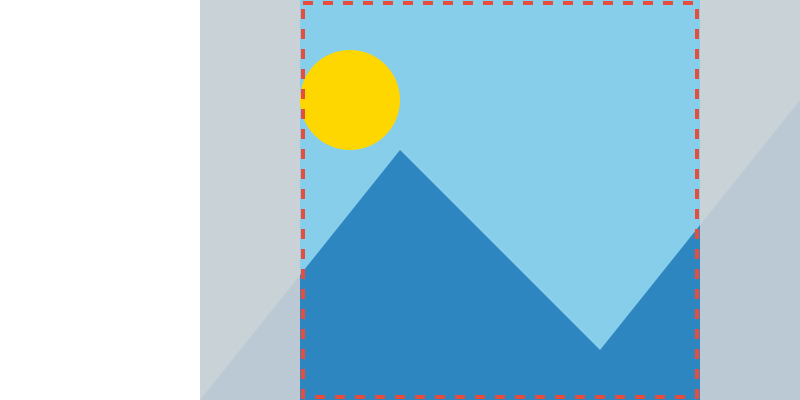
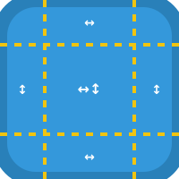

# DALi UI Foundation - ImageView

[→ 한국어 문서](https://github.sec.samsung.net/NUI/dali-ui/wiki/ImageView-(kr))

`ImageView` is a view for displaying image resources. It supports a variety of image formats and provides controls for fitting, sampling, masking, loading policy, and N-patch borders.

---

## Table of Contents

1. [Basic Setup](#1-basic-setup)
2. [Fitting Mode](#2-fitting-mode)
3. [Sampling Mode](#3-sampling-mode)
4. [Key Properties and Methods](#4-key-properties-and-methods)
   - [Image Resource](#41-image-resource)
   - [Placeholder Image](#42-placeholder-image)
   - [Image Color](#43-image-color)
   - [Pixel Area (Sub-region)](#44-pixel-area-sub-region)
   - [Desired Size](#45-desired-size)
   - [Image Load With View Size](#46-image-load-with-view-size)
5. [Advanced Rendering & Masking](#5-advanced-rendering--masking)
   - [Alpha Mask](#51-alpha-mask)
   - [Masking Mode](#52-masking-mode)
   - [Pre-multiplied Alpha](#53-pre-multiplied-alpha)
6. [Loading Behavior](#6-loading-behavior)
   - [Synchronous Loading](#61-synchronous-loading)
   - [Release Policy](#62-release-policy)
   - [Fast-track Uploading](#63-fast-track-uploading)
   - [Orientation Correction](#64-orientation-correction)
7. [N-Patch Border](#7-n-patch-border)
8. [Loading Status & Signals](#8-loading-status--signals)
9. [Method Chaining](#9-method-chaining)
10. [Default Values](#10-default-values)
11. [Important Notes](#11-important-notes)

---

## 1. Basic Setup

Create an `ImageView` using the static factory method `New()`. Images are loaded asynchronously by default.

```cpp
#include <dali-ui-foundation/dali-ui-foundation.h>

using namespace Dali::Ui;

// Create an empty ImageView
ImageView imageView = ImageView::New();

// Create an ImageView with an image URL
ImageView imageView = ImageView::New("image.png");

// Set size
imageView.SetRequestedWidth(200.0f);
imageView.SetRequestedHeight(200.0f);

// Add to the scene
window.Add(imageView);
```

---

## 2. Fitting Mode

`FittingMode` controls how the image is fitted within the view bounds.

```cpp
// Scale to fit while preserving aspect ratio (default)
imageView.SetFittingMode(FittingMode::FIT_KEEP_ASPECT_RATIO);

// Stretch to fill the entire view (may distort)
imageView.SetFittingMode(FittingMode::FILL);

// Scale to fill, cropping overflow (preserves aspect ratio)
imageView.SetFittingMode(FittingMode::OVER_FIT_KEEP_ASPECT_RATIO);

// Keep original image size, centered
imageView.SetFittingMode(FittingMode::CENTER);
```

| Value | Behavior |
|---|---|
| `FIT_KEEP_ASPECT_RATIO` | Scale to fit within bounds, preserving aspect ratio. Default. |
| `FILL` | Stretch to fill entire bounds, may distort. |
| `OVER_FIT_KEEP_ASPECT_RATIO` | Scale to fill bounds, overflow is cropped. |
| `CENTER` | Display at original size, centered in the view. |
| `FIT_HEIGHT` | Scale height proportionately (deprecated). |
| `FIT_WIDTH` | Scale width proportionately (deprecated). |
| `DONT_CARE` | No specific fitting mode applied. |

### Visual Example

Assuming: **Image 600x400** inside a **View 800x800** (View is larger than image)

**Original Image (600x400):**


| Mode | Visual Result |
|:---:|:---|
| **FIT_KEEP_ASPECT_RATIO** |  |
| **FILL** |  |
| **OVER_FIT_KEEP_ASPECT_RATIO** |  |
| **CENTER** |  |

**Quick Comparison:**

| Scenario | Best Mode |
|:---|:---|
| Photos, avatars (no distortion) | `FIT_KEEP_ASPECT_RATIO` |
| Background images (fill entire area) | `FILL` or `OVER_FIT_KEEP_ASPECT_RATIO` |
| Icons, thumbnails (original size) | `CENTER` |

---

## 3. Sampling Mode

`SamplingMode` controls the filter applied when scaling the image. It is defined in `dali-ui-foundation/public-api/image-view/image-view-types.h` as an alias to `Dali::SamplingMode`.

```cpp
#include <dali-ui-foundation/public-api/image-view/image-view-types.h>

using namespace Dali::Ui;

// Nearest-neighbor (pixelated, fast)
imageView.SetSamplingMode(SamplingMode::NEAREST);

// Linear filtering (smooth, default)
imageView.SetSamplingMode(SamplingMode::LINEAR);

// Box filtering (for downscaling)
imageView.SetSamplingMode(SamplingMode::BOX);

// No filtering
imageView.SetSamplingMode(SamplingMode::DONT_CARE);
```

| Value | Use Case |
|---|---|
| `NEAREST` | Pixel art, sharp edges, fast rendering |
| `LINEAR` | Photos, smooth scaling (default) |
| `BOX` | High-quality downscaling |
| `DONT_CARE` | No preference, let system decide |

---

## 4. Key Properties and Methods

### 4.1 Image Resource

Set or change the image displayed by the view.

```cpp
// Set image URL
imageView.SetResourceUrl("images/photo.jpg");

// Get current URL
Dali::String url = imageView.GetResourceUrl();

// Reload the image from the same URL
imageView.Reload();
```

Supported URL formats:
- Local file path: `"images/photo.jpg"`
- HTTP/HTTPS: `"https://example.com/image.png"`

---

### 4.2 Placeholder Image

Set a placeholder image to display while the main image is loading.

```cpp
imageView.SetPlaceholderUrl("images/placeholder.png");

Dali::String placeholderUrl = imageView.GetPlaceholderUrl();
```

---

### 4.3 Image Color

Apply a color multiplier to the image. Accepts both direct RGBA values and theme color tokens.

```cpp
// Using hex color
imageView.SetImageColor(UiColor(0xFF0000FF));  // Red tint

// Using RGBA values
imageView.SetImageColor(UiColor(1.0f, 0.5f, 0.0f, 1.0f));  // Orange tint

// Get current color
UiColor color = imageView.GetImageColor();
```

---

### 4.4 Pixel Area (Sub-region)

Display only a sub-region of the image. Coordinates are normalized (0.0 to 1.0).

```cpp
// Display the top-left quarter of the image
imageView.SetPixelArea(Vector4(0.0f, 0.0f, 0.5f, 0.5f));

// Display the center region
imageView.SetPixelArea(Vector4(0.25f, 0.25f, 0.5f, 0.5f));

// Reset to show full image
imageView.SetPixelArea(Vector4(0.0f, 0.0f, 1.0f, 1.0f));

Vector4 area = imageView.GetPixelArea();
```

The `Vector4` represents `(x, y, width, height)` in normalized coordinates.

---

### 4.5 Desired Size

Hint for the image loader about the desired dimensions.

```cpp
imageView.SetDesiredSize(ImageDimensions(800, 600));

ImageDimensions size = imageView.GetDesiredSize();
```

This can be used to load a lower-resolution version of the image to save memory.

---

### 4.6 Image Load With View Size

Load the image at the current view size, saving memory and decode time.

```cpp
imageView.SetImageLoadWithViewSize(true);

bool enabled = imageView.GetImageLoadWithViewSize();
```

When enabled:
- Image is (re)loaded at the view's resolved layout size
- Avoids loading full-resolution image when only smaller display is needed
- Direction: view size → image load size

---

## 5. Advanced Rendering & Masking

### 5.1 Alpha Mask

Apply an alpha mask image to the main image.

```cpp
imageView.SetAlphaMaskUrl("images/mask.png");

// Crop the image to the mask bounds
imageView.SetCropToMask(true);

Dali::String maskUrl = imageView.GetAlphaMaskUrl();
bool cropToMask = imageView.GetCropToMask();
```

---

### 5.2 Masking Mode

Control when masking is applied.

```cpp
// Apply mask during rendering (default)
imageView.SetMaskingMode(MaskingType::MASKING_ON_RENDERING);

// Apply mask during image loading
imageView.SetMaskingMode(MaskingType::MASKING_ON_LOADING);

MaskingType::Type mode = imageView.GetMaskingMode();
```

| Value | Behavior |
|---|---|
| `MASKING_ON_RENDERING` | Masking applied in rendering phase. Default. |
| `MASKING_ON_LOADING` | Masking applied during loading (more efficient). |

---

### 5.3 Pre-multiplied Alpha

Control whether the image uses pre-multiplied alpha.

```cpp
imageView.SetPreMultipliedAlpha(true);

bool preMultiplied = imageView.GetPreMultipliedAlpha();
```

---

## 6. Loading Behavior

### 6.1 Synchronous Loading

Load the image synchronously on the main thread (blocks until loaded).

```cpp
imageView.SetSynchronousLoading(true);

bool sync = imageView.GetSynchronousLoading();
```

> **Note:** Synchronous loading can cause UI jank. Use only for small images or when absolutely necessary.

---

### 6.2 Release Policy

Control when the image texture is released from memory.

```cpp
// Release when visual is detached from scene (default)
imageView.SetReleasePolicy(ReleasePolicy::DETACHED);

// Release when visual is destroyed
imageView.SetReleasePolicy(ReleasePolicy::DESTROYED);

// Never release from cache
imageView.SetReleasePolicy(ReleasePolicy::NEVER);

ReleasePolicy::Type policy = imageView.GetReleasePolicy();
```

| Value | Behavior |
|---|---|
| `DETACHED` | Released when visual is detached from scene. Default. |
| `DESTROYED` | Released when visual is destroyed. |
| `NEVER` | Kept in cache indefinitely. Use carefully. |

---

### 6.3 Fast-track Uploading

Upload image to GPU on a background thread to reduce main-thread stalls.

```cpp
imageView.SetFastTrackUploading(true);

bool enabled = imageView.GetFastTrackUploading();
```

---

### 6.4 Orientation Correction

Automatically apply EXIF orientation metadata.

```cpp
imageView.SetOrientationCorrection(true);

bool enabled = imageView.GetOrientationCorrection();
```

---

## 7. N-Patch Border

N-patch (9-patch) images stretch only the defined border regions, keeping corners and edges intact.

```cpp
// Set border insets (left, top, right, bottom)
imageView.SetNPatchBorder(Vector4(10.0f, 10.0f, 10.0f, 10.0f));

// Render only the border, not the center
imageView.SetNPatchBorderOnly(true);

Vector4 border = imageView.GetNPatchBorder();
bool borderOnly = imageView.GetNPatchBorderOnly();
```

### N-Patch Visual Example

**9-Patch Region Structure:**



**Comparison: Normal Scaling vs N-Patch:**

| Original Image | Normal Image Scaling (Distorted) | N-Patch Applied |
|:---:|:---:|:---:|
|  |  |  |

**Key Points:**
- 🔳 **Corners** remain fixed at original size
- ↔️ **Top/Bottom edges** stretch horizontally only
- ↕️ **Left/Right edges** stretch vertically only
- 🟧 **Center** stretches in both directions

---

## 8. Loading Status & Signals

### Checking Loading Status

```cpp
Visual::ResourceStatus status = imageView.GetLoadingStatus();

if(status == Visual::ResourceStatus::READY)
{
    // Image is loaded and ready
}
else if(status == Visual::ResourceStatus::LOADING)
{
    // Image is currently loading
}
else if(status == Visual::ResourceStatus::FAILED)
{
    // Image failed to load
}
```

### Resource Ready Signal

Connect to be notified when the image finishes loading.

```cpp
class MyImageHandler : public Dali::ConnectionTracker
{
public:
    void OnImageReady(ImageView imageView)
    {
        // Image has finished loading and is ready to display
        DALI_LOG_RELEASE_INFO("Image loaded successfully!\n");
    }
};

MyImageHandler handler;
imageView.ResourceReadySignal().Connect(&handler, &MyImageHandler::OnImageReady);
```

---

## 9. Method Chaining

All setters return `ImageView&`, enabling fluent configuration:

```cpp
ImageView imageView = ImageView::New("photo.jpg");

imageView
    .SetFittingMode(FittingMode::FIT_KEEP_ASPECT_RATIO)
    .SetSamplingMode(SamplingMode::LINEAR)
    .SetImageColor(UiColor(0xFFFFFFFF))
    .SetSynchronousLoading(false)
    .SetFastTrackUploading(true)
    .SetOrientationCorrection(true)
    .SetReleasePolicy(ReleasePolicy::DETACHED);
```

---

## 10. Default Values

| Property | Default |
|---|---|
| `FittingMode` | `FIT_KEEP_ASPECT_RATIO` |
| `SamplingMode` | `LINEAR` |
| `ImageColor` | White `(1.0, 1.0, 1.0, 1.0)` |
| `PixelArea` | `(0.0, 0.0, 1.0, 1.0)` (full image) |
| `ImageLoadWithViewSize` | `false` |
| `SynchronousLoading` | `false` |
| `FastTrackUploading` | `false` |
| `OrientationCorrection` | `true` |
| `ReleasePolicy` | `DETACHED` |
| `PreMultipliedAlpha` | `false` |
| `CropToMask` | `false` |
| `MaskingMode` | `MASKING_ON_RENDERING` |
| `NPatchBorder` | `(0.0, 0.0, 0.0, 0.0)` |
| `NPatchBorderOnly` | `false` |

---

## 11. Important Notes

- **Asynchronous loading by default.** Use `ResourceReadySignal()` to know when loading completes.


- **Memory management.** Use `ReleasePolicy` to control when textures are released. `NEVER` should be used carefully as it can lead to memory leaks.

- **N-patch images.** Setting a non-zero `SetNPatchBorder()` activates N-patch rendering automatically.

- **Pixel area is normalized.** `SetPixelArea()` uses coordinates in range [0, 1], not pixel values.

- **URL changes trigger reload.** Calling `SetResourceUrl()` with a new URL automatically triggers loading. Use `Reload()` to reload the same URL.

<br/>

---

[← Back to list](https://github.sec.samsung.net/NUI/dali-ui/wiki#documents)